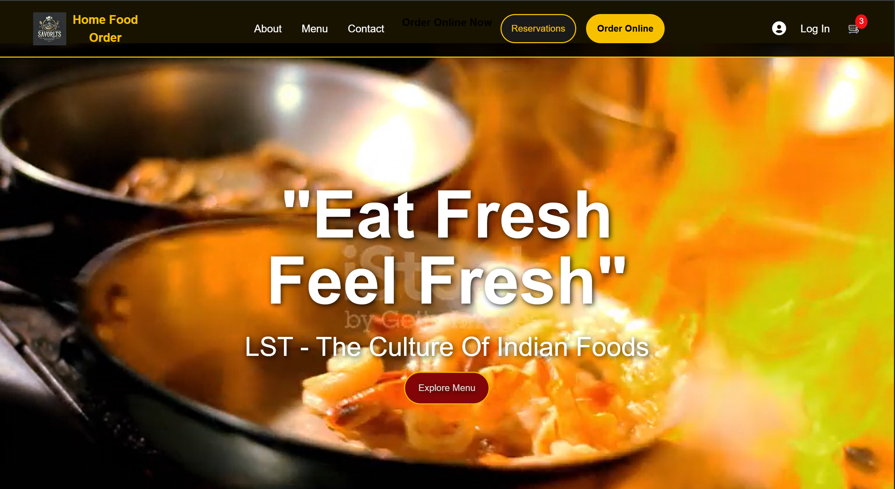
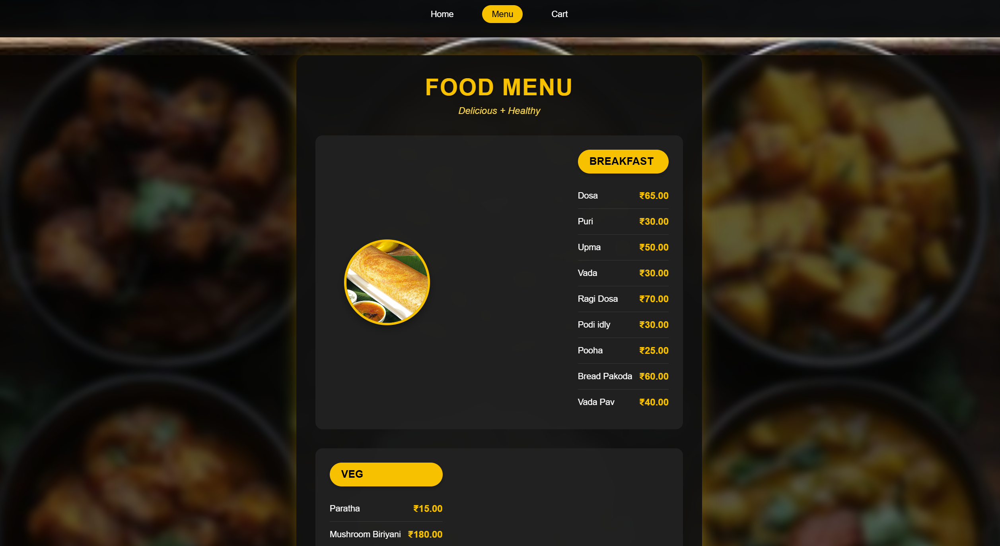
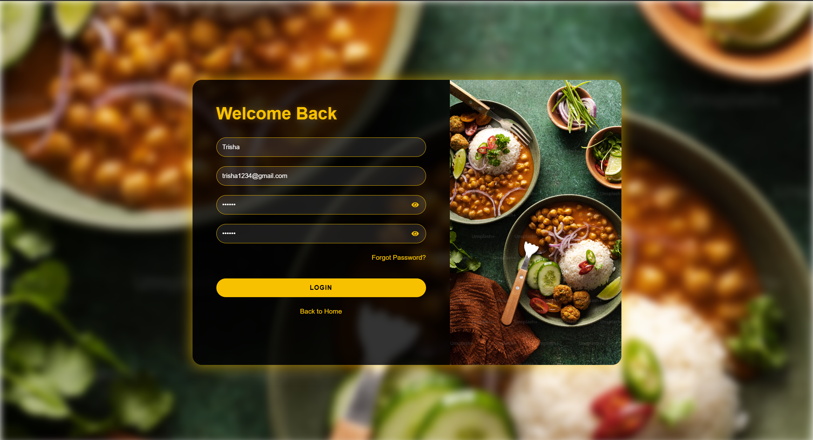
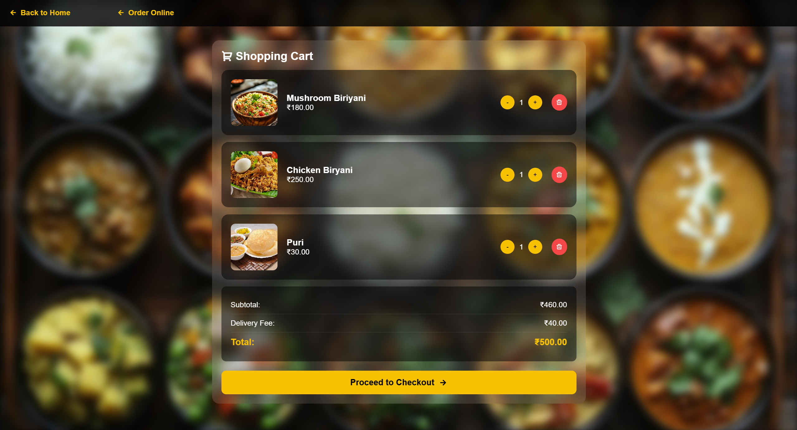

# 🍽️ Restaurant Website

A fully responsive restaurant website built using **HTML, CSS, and JavaScript**.
This project showcases a modern UI with multiple pages like menu, login, cart, and reservation.

---

## 🚀 Live Demo

👉 https://trisha3662.github.io/restaurant-website/

---

## 📌 Features

* 🏠 Home page with attractive layout
* 📋 Menu page with food items
* 🛒 Cart functionality UI
* 🔐 Login & authentication pages
* 📅 Table reservation system UI
* 📱 Fully responsive design
* 🎨 Clean and modern UI

---

## 🛠️ Technologies Used

* HTML5
* CSS3
* JavaScript

---

## 📸 Screenshots

### 🏠 Home Page



### 📋 Menu Page



### 🔐 Login Page



### 🛒 Cart Page



---

## 📂 Project Structure

restaurant-website/
│── css/
│── js/
│── image/
│── screenshots/
│── index.html
│── menu.html
│── login.html
│── cart.html
│── order.html
│── reservation.html

---

## ⚙️ How to Run Locally

1. Clone the repository

```bash
git clone https://github.com/trisha3662/restaurant-website.git
```

2. Open the folder

3. Run `index.html` in browser

---

## 📈 Future Improvements

* Add backend (Node.js / Firebase)
* Add real authentication system
* Payment integration
* Admin dashboard

---

## 🙌 Author

**Trisha**

* GitHub: https://github.com/trisha3662

---

## ⭐ Show your support

If you like this project, give it a ⭐ on GitHub!
